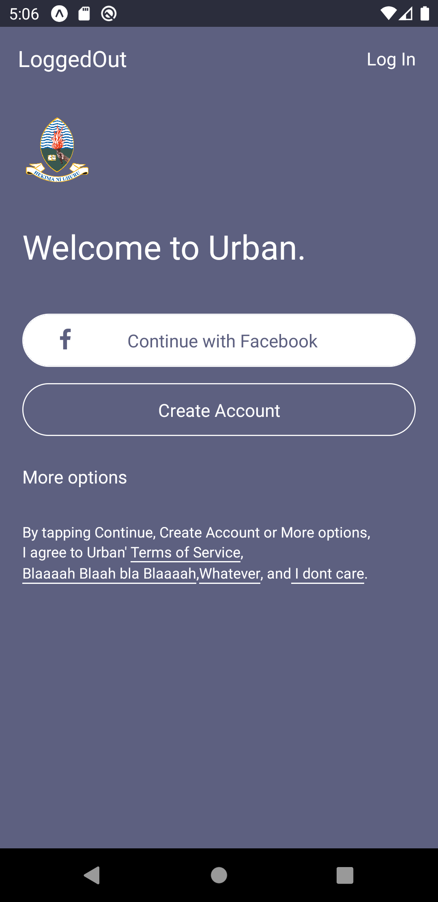
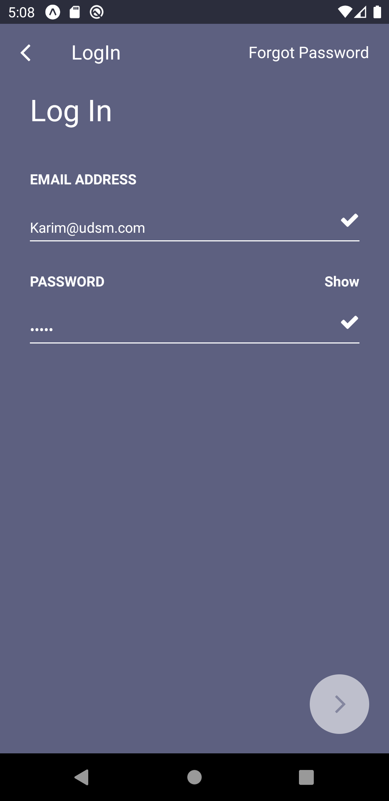
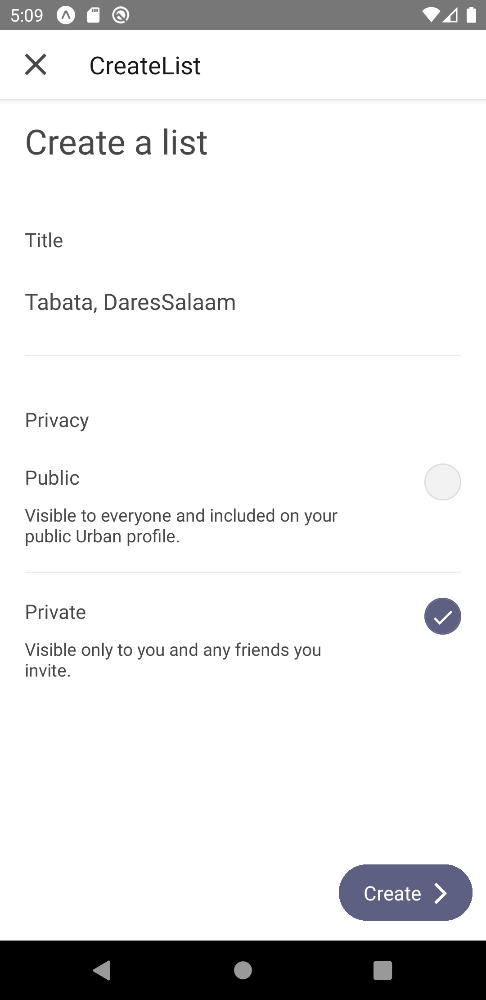
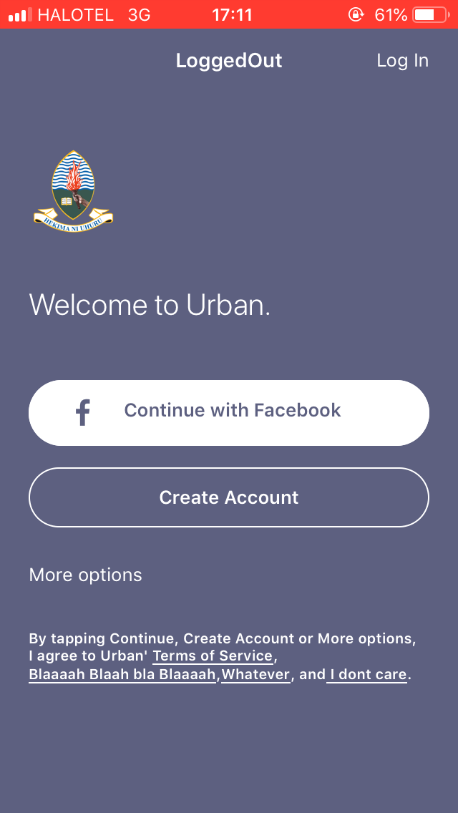
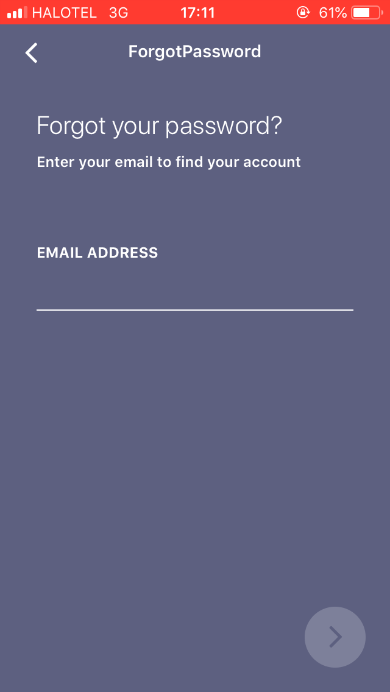

# UrbanApp
Front end for class project App

## How to use
* Clone the repo ```git clone https://github.com/CS-Project-UDSM/UrbanApp.git```
* ```cd UrbanApp```
* Run ```npm install && npm start```
* Run on IOS/Android emulator or Expo

### Screenshots

#### Android
<table>
  <tr>
    <td></td>
    <td></td>
    <td></td>
    <td></td>
    <td></td>
  <tr>
</table>

#### IOS
<table>
  <tr>
    <td></td>
    <td></td>
    <td></td>
    <td></td>
    <td></td>
    <td></td>
  <tr>
</table>
